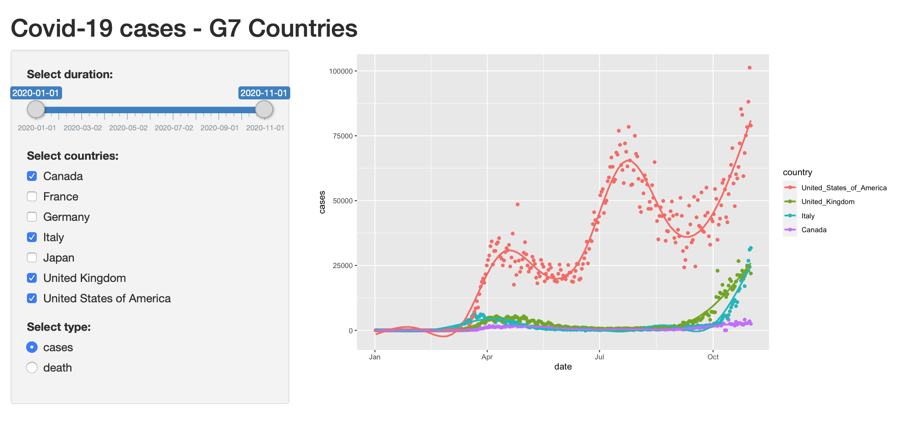

```{r setup, include=FALSE}
knitr::opts_chunk$set(echo = FALSE)
```

## Introduction
<font size="4">This application is to visualize the number of COVID-19 cases or death for G7 countries (Canada, France, Germany, Italy, Japan, UK, USA).  The duration can be changed by a slider bar, and target countries can be selected by check boxes.  Finaly, a user select which data (cases or death) should be visualized by a radio button.</font>  


## Data and preprocess
<font size="4">COVID-19 data was downloaded from the EU Open Data Portal<sup>[1]</sup>, which included daily data from 213 countries and territories.  Then, we extracted data for G7 countries (Canada, France, Germany, Italy, Japan, UK, USA) with required attributes.
</font>

```{r data, echo=TRUE, warning=FALSE, message=FALSE, cache=TRUE}
library(utils)
library(stringr)
#read the Dataset sheet into “R”. The dataset will be called "data".
data <- read.csv("https://opendata.ecdc.europa.eu/covid19/casedistribution/csv", na.strings = "", 
                 fileEncoding = "UTF-8-BOM")
data = as.data.frame(data)
g7 = subset(data,(countriesAndTerritories == 'France' |
                  countriesAndTerritories == 'United_States_of_America' |
                  countriesAndTerritories == 'United_Kingdom' |
                  countriesAndTerritories == 'Germany' |
                  countriesAndTerritories == 'Japan' |
                  countriesAndTerritories == 'Italy' |
                  countriesAndTerritories == 'Canada'))
g7_date <- str_c(g7$year, g7$month, sep='/')
g7_date <- str_c(g7_date, g7$day, sep='/')
g7$dateRep <- as.POSIXct(g7_date)
g7 <- g7[, c(1,5,6,7,10)]
colnames(g7) <- c('date','cases','death','country','population')
```
## Updating Outputs
<font size="4">There are thee tasks in server.R to update a screen based on selected items.  
<br>
1) get updated duration (start/end), and create a subset of data to fit to the selected duration   
</font>
```{r duration, echo=TRUE, eval=FALSE, warning=FALSE, message=FALSE}
        # set start/end days based on input$range from ui.R
        day_d1 <- input$range[1]
        day_d2 <- input$range[2]
        g7_stage <- subset(g7, ((date >= day_d1) & (date <= day_d2)))
```
<font size="4">  
2) get the name of countries to be displayed, and create a subset   
</font>
```{r country, echo=TRUE, eval=FALSE, warning=FALSE, message=FALSE}
        for (i in input$countries) {
            g7_country <- subset(g7_stage, country == i)
            if (exists("g7_summary") == FALSE) {
                g7_summary <- g7_country
            } else {
                g7_summary <- rbind(g7_summary, g7_country)
            }
        }
```
## Updating Outputs   cont..
<font size="4">  
3) get data type (either "cases" or "death"), and select a column that contains specified data  

To plot the data, we need to find a smooth line from scatter data in a selected duration.   
For this, we selected **GAM (generalized additive model)** to recalculate a line.  
</font>
```{r cases, echo=TRUE, eval=FALSE, warning=FALSE, message=FALSE}
        library(ggplot2)
        # select either "cases" or "death" based on input$type
        if (input$type == 'cases') {
            g <- ggplot(g7_summary, aes(x=date, y=cases, color=country))
            } else {
            g <- ggplot(g7_summary, aes(x=date, y=death, color=country))
        }
        # apply "GAM" to recalculate a line
        g <- g + geom_point() + geom_smooth(method='gam', se=FALSE) xlab("date") + ylab(input$type)
```
  
<br>  
  
**References** 
<font size="2">  
[1] EU Open Data Portal, "COVID-19 Coronavirus data", https://data.europa.eu/euodp/en/data/dataset/covid-19-coronavirus-data
</font>